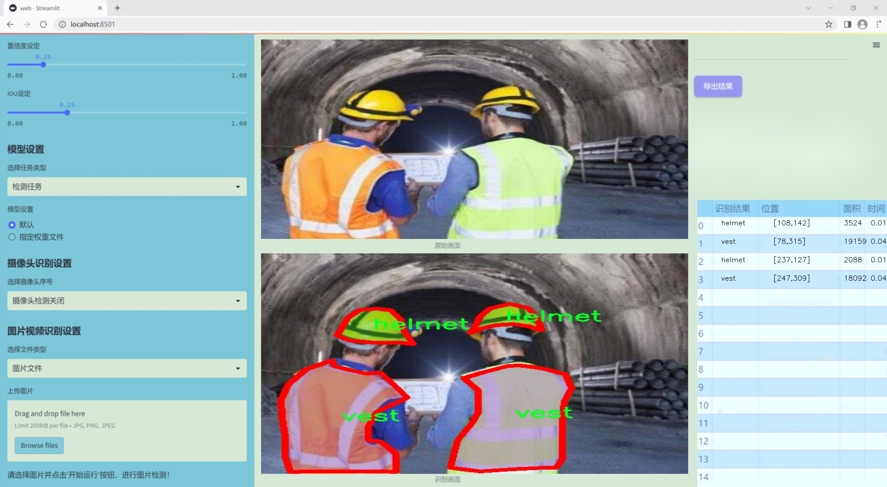
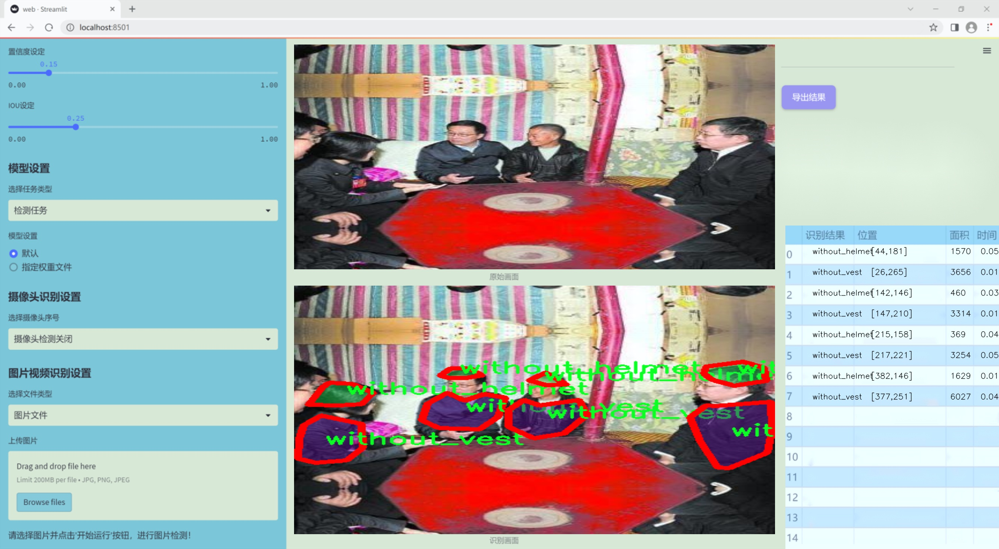
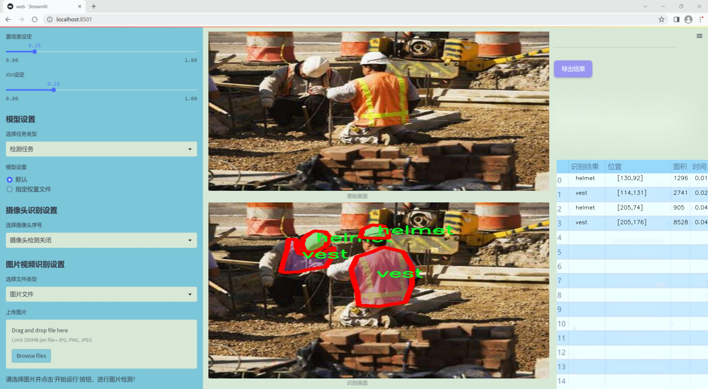
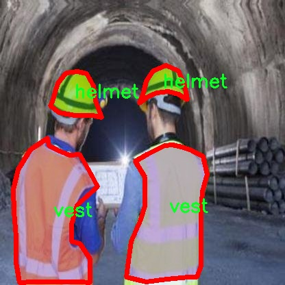
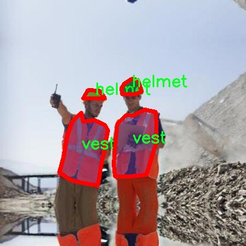
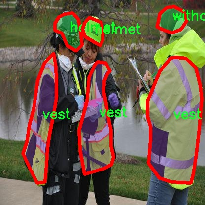

# 改进yolo11-DBBNCSPELAN等200+全套创新点大全：安全帽等施工现场安全防护装备识别图像分割系统源码＆数据集全套

### 1.图片效果展示







##### 项目来源 **[人工智能促进会 2024.10.24](https://kdocs.cn/l/cszuIiCKVNis)**

注意：由于项目一直在更新迭代，上面“1.图片效果展示”和“2.视频效果展示”展示的系统图片或者视频可能为老版本，新版本在老版本的基础上升级如下：（实际效果以升级的新版本为准）

  （1）适配了YOLOV11的“目标检测”模型和“实例分割”模型，通过加载相应的权重（.pt）文件即可自适应加载模型。

  （2）支持“图片识别”、“视频识别”、“摄像头实时识别”三种识别模式。

  （3）支持“图片识别”、“视频识别”、“摄像头实时识别”三种识别结果保存导出，解决手动导出（容易卡顿出现爆内存）存在的问题，识别完自动保存结果并导出到tempDir中。

  （4）支持Web前端系统中的标题、背景图等自定义修改。

  另外本项目提供训练的数据集和训练教程,暂不提供权重文件（best.pt）,需要您按照教程进行训练后实现图片演示和Web前端界面演示的效果。

### 2.视频效果展示

[2.1 视频效果展示](https://www.bilibili.com/video/BV1xa1hYHEza/)

### 3.背景

研究背景与意义

随着建筑行业的快速发展，施工现场的安全问题日益凸显。根据相关统计数据，施工现场的安全事故频发，严重影响了工人的生命安全和企业的经济效益。因此，如何有效地识别和监控施工现场的安全防护装备，成为了提升施工安全管理水平的重要课题。安全帽和安全背心作为施工现场的基本防护装备，其佩戴情况直接关系到工人的安全。因此，开发一种高效的图像识别系统，能够实时监测工人是否佩戴安全帽和安全背心，对于降低事故发生率、提高安全管理效率具有重要意义。

在此背景下，基于改进YOLOv11的安全帽等施工现场安全防护装备识别图像分割系统应运而生。YOLO（You Only Look Once）系列模型以其高效的实时检测能力和较高的准确率，广泛应用于目标检测领域。针对施工现场的特殊需求，本项目将对YOLOv11进行改进，以提高其在复杂环境下的识别精度和速度。项目所使用的数据集包含204张图像，涵盖了安全帽、反光背心、未佩戴安全帽和未佩戴背心等四个类别。这一数据集的构建为模型的训练和评估提供了坚实的基础，确保了系统在实际应用中的有效性。

通过本项目的实施，不仅能够提升施工现场的安全防护水平，还能够为相关企业提供数据支持和决策依据。随着技术的不断进步，未来的施工现场安全管理将更加依赖于智能化、自动化的手段。基于改进YOLOv11的图像分割系统，将为施工现场的安全管理提供新的解决方案，推动建筑行业的安全文化建设，具有重要的社会价值和经济意义。

### 4.数据集信息展示

##### 4.1 本项目数据集详细数据（类别数＆类别名）

nc: 4
names: ['helmet', 'vest', 'without_helmet', 'without_vest']


该项目为【图像分割】数据集，请在【训练教程和Web端加载模型教程（第三步）】这一步的时候按照【图像分割】部分的教程来训练

##### 4.2 本项目数据集信息介绍

本项目数据集信息介绍

本项目所使用的数据集名为“Construction Site”，旨在为改进YOLOv11的安全帽及其他施工现场安全防护装备的识别图像分割系统提供强有力的支持。该数据集专注于施工现场的安全防护装备，包含四个主要类别，分别是“安全帽（helmet）”、“安全背心（vest）”、“未佩戴安全帽（without_helmet）”以及“未佩戴安全背心（without_vest）”。这些类别的划分不仅反映了施工现场的安全管理需求，也为系统的精确识别和分类提供了基础。

数据集的构建过程中，考虑到了多样性和代表性，涵盖了不同环境、光照条件及角度下的施工现场图像。这种多样性确保了模型在实际应用中的鲁棒性和适应性，使其能够有效应对各种复杂场景。此外，数据集中包含的图像均经过精细标注，确保每个类别的边界清晰，便于进行图像分割任务的训练与评估。

通过使用“Construction Site”数据集，研究团队希望能够显著提升YOLOv11在安全防护装备识别方面的性能。尤其是在施工现场，及时识别佩戴情况对于保障工人安全至关重要。未佩戴安全装备的情况不仅可能导致工人面临安全风险，也可能引发法律责任和经济损失。因此，准确识别和分类这些装备，能够为施工现场的安全管理提供数据支持，进而推动安全文化的建设。

总之，“Construction Site”数据集的设计与构建，旨在为安全防护装备的智能识别提供坚实的基础，助力于提高施工现场的安全管理水平，最终实现更高效的安全防护和风险控制。









### 5.全套项目环境部署视频教程（零基础手把手教学）

[5.1 所需软件PyCharm和Anaconda安装教程（第一步）](https://www.bilibili.com/video/BV1BoC1YCEKi/?spm_id_from=333.999.0.0&vd_source=bc9aec86d164b67a7004b996143742dc)


[5.2 安装Python虚拟环境创建和依赖库安装视频教程（第二步）](https://www.bilibili.com/video/BV1ZoC1YCEBw?spm_id_from=333.788.videopod.sections&vd_source=bc9aec86d164b67a7004b996143742dc)

### 6.改进YOLOv11训练教程和Web_UI前端加载模型教程（零基础手把手教学）

[6.1 改进YOLOv11训练教程和Web_UI前端加载模型教程（第三步）](https://www.bilibili.com/video/BV1BoC1YCEhR?spm_id_from=333.788.videopod.sections&vd_source=bc9aec86d164b67a7004b996143742dc)


按照上面的训练视频教程链接加载项目提供的数据集，运行train.py即可开始训练



     Epoch   gpu_mem       box       obj       cls    labels  img_size
     1/200     20.8G   0.01576   0.01955  0.007536        22      1280: 100%|██████████| 849/849 [14:42<00:00,  1.04s/it]
               Class     Images     Labels          P          R     mAP@.5 mAP@.5:.95: 100%|██████████| 213/213 [01:14<00:00,  2.87it/s]
                 all       3395      17314      0.994      0.957      0.0957      0.0843

     Epoch   gpu_mem       box       obj       cls    labels  img_size
     2/200     20.8G   0.01578   0.01923  0.007006        22      1280: 100%|██████████| 849/849 [14:44<00:00,  1.04s/it]
               Class     Images     Labels          P          R     mAP@.5 mAP@.5:.95: 100%|██████████| 213/213 [01:12<00:00,  2.95it/s]
                 all       3395      17314      0.996      0.956      0.0957      0.0845

     Epoch   gpu_mem       box       obj       cls    labels  img_size
     3/200     20.8G   0.01561    0.0191  0.006895        27      1280: 100%|██████████| 849/849 [10:56<00:00,  1.29it/s]
               Class     Images     Labels          P          R     mAP@.5 mAP@.5:.95: 100%|███████   | 187/213 [00:52<00:00,  4.04it/s]
                 all       3395      17314      0.996      0.957      0.0957      0.0845


###### [项目数据集下载链接](https://kdocs.cn/l/cszuIiCKVNis)

### 7.原始YOLOv11算法讲解


##### YOLOv11三大损失函数

YOLOv11（You Only Look Once）是一种流行的目标检测算法，其损失函数设计用于同时优化分类和定位任务。YOLO的损失函数通常包括几个部分：
**分类损失、定位损失（边界框回归损失）和置信度损失** 。其中，

  1. box_loss（边界框回归损失）是用于优化预测边界框与真实边界框之间的差异的部分。

  2. cls_loss（分类损失）是用于优化模型对目标类别的预测准确性的部分。分类损失确保模型能够正确地识别出图像中的对象属于哪个类别。

  3. dfl_loss（Distribution Focal Loss）是YOLO系列中的一种损失函数，特别是在一些改进版本如YOLOv5和YOLOv7中被引入。它的主要目的是解决目标检测中的类别不平衡问题，并提高模型在处理小目标和困难样本时的性能。

##### 边界框回归损失详解

box_loss（边界框回归损失）是用于优化预测边界框与真实边界框之间的差异的部分。


##### box_loss 的具体意义


##### 为什么需要 box_loss

  * 精确定位：通过最小化中心点坐标损失和宽高损失，模型能够更准确地预测目标的位置和大小。
  * 平衡不同类型的目标：使用平方根来处理宽高损失，可以更好地平衡不同大小的目标，确保小目标也能得到足够的关注。
  * 稳定训练：适当的损失函数设计有助于模型的稳定训练，避免梯度爆炸或消失等问题。

##### 分类损失详解

在YOLO（You Only Look
Once）目标检测算法中，cls_loss（分类损失）是用于优化模型对目标类别的预测准确性的部分。分类损失确保模型能够正确地识别出图像中的对象属于哪个类别。下面是关于cls_loss的详细解读：

##### 分类损失 (cls_loss) 的具体意义

  
分类损失通常使用交叉熵损失（Cross-Entropy
Loss）来计算。交叉熵损失衡量的是模型预测的概率分布与真实标签之间的差异。在YOLO中，分类损失的具体形式如下：


##### 为什么需要 cls_loss

  * 类别识别：cls_loss 确保模型能够正确识别出图像中的目标属于哪个类别。这对于目标检测任务至关重要，因为不仅需要知道目标的位置，还需要知道目标的类型。

  * 多类别支持：通过最小化分类损失，模型可以处理多个类别的目标检测任务。例如，在道路缺陷检测中，可能需要识别裂缝、坑洞、路面破损等多种类型的缺陷。

  * 提高准确性：分类损失有助于提高模型的分类准确性，从而提升整体检测性能。通过优化分类损失，模型可以更好地学习不同类别之间的特征差异。

##### 分布损失详解

`dfl_loss`（Distribution Focal
Loss）是YOLO系列中的一种损失函数，特别是在一些改进版本如YOLOv5和YOLOv7中被引入。它的主要目的是解决目标检测中的类别不平衡问题，并提高模型在处理小目标和困难样本时的性能。下面是对`dfl_loss`的详细解读：

##### DFL Loss 的背景

在目标检测任务中，类别不平衡是一个常见的问题。某些类别的样本数量可能远远多于其他类别，这会导致模型在训练过程中对常见类别的学习效果较好，而对罕见类别的学习效果较差。此外，小目标和困难样本的检测也是一个挑战，因为这些目标通常具有较少的特征信息，容易被忽略或误分类。

为了应对这些问题，研究者们提出了多种改进方法，其中之一就是`dfl_loss`。`dfl_loss`通过引入分布焦点损失来增强模型对困难样本的关注，并改善类别不平衡问题。

##### DFL Loss 的定义

DFL Loss
通常与传统的交叉熵损失结合使用，以增强模型对困难样本的学习能力。其核心思想是通过对每个类别的预测概率进行加权，使得模型更加关注那些难以正确分类的样本。

DFL Loss 的公式可以表示为：


##### DFL Loss 的具体意义**

  * **类别不平衡：** 通过引入平衡因子 α，DFL Loss 可以更好地处理类别不平衡问题。对于少数类别的样本，可以通过增加其权重来提升其重要性，从而提高模型对这些类别的检测性能。
  *  **困难样本：** 通过聚焦参数 γ，DFL Loss 可以让模型更加关注那些难以正确分类的样本。当 
  * γ 较大时，模型会对那些预测概率较低的样本给予更多的关注，从而提高这些样本的分类准确性。
  *  **提高整体性能** ：DFL Loss 结合了传统交叉熵损失的优势，并通过加权机制增强了模型对困难样本的学习能力，从而提高了整体的检测性能。


### 8.200+种全套改进YOLOV11创新点原理讲解

#### 8.1 200+种全套改进YOLOV11创新点原理讲解大全

由于篇幅限制，每个创新点的具体原理讲解就不全部展开，具体见下列网址中的改进模块对应项目的技术原理博客网址【Blog】（创新点均为模块化搭建，原理适配YOLOv5~YOLOv11等各种版本）

[改进模块技术原理博客【Blog】网址链接](https://gitee.com/qunmasj/good)


#### 8.2 精选部分改进YOLOV11创新点原理讲解

###### 这里节选部分改进创新点展开原理讲解(完整的改进原理见上图和[改进模块技术原理博客链接](https://gitee.com/qunmasj/good)【如果此小节的图加载失败可以通过CSDN或者Github搜索该博客的标题访问原始博客，原始博客图片显示正常】


借鉴了其他算法的这些设计思想

借鉴了VGG的思想，使用了较多的3×3卷积，在每一次池化操作后，将通道数翻倍；

借鉴了network in network的思想，使用全局平均池化（global average pooling）做预测，并把1×1的卷积核置于3×3的卷积核之间，用来压缩特征；（我没找到这一步体现在哪里）

使用了批归一化层稳定模型训练，加速收敛，并且起到正则化作用。

    以上三点为Darknet19借鉴其他模型的点。Darknet53当然是在继承了Darknet19的这些优点的基础上再新增了下面这些优点的。因此列在了这里

借鉴了ResNet的思想，在网络中大量使用了残差连接，因此网络结构可以设计的很深，并且缓解了训练中梯度消失的问题，使得模型更容易收敛。

使用步长为2的卷积层代替池化层实现降采样。（这一点在经典的Darknet-53上是很明显的，output的长和宽从256降到128，再降低到64，一路降低到8，应该是通过步长为2的卷积层实现的；在YOLOv11的卷积层中也有体现，比如图中我标出的这些位置）

#### 特征融合

模型架构图如下

  Darknet-53的特点可以这样概括：（Conv卷积模块+Residual Block残差块）串行叠加4次

  Conv卷积层+Residual Block残差网络就被称为一个stage


上面红色指出的那个，原始的Darknet-53里面有一层 卷积，在YOLOv11里面，把一层卷积移除了

为什么移除呢？

        原始Darknet-53模型中间加的这个卷积层做了什么？滤波器（卷积核）的个数从 上一个卷积层的512个，先增加到1024个卷积核，然后下一层卷积的卷积核的个数又降低到512个

        移除掉这一层以后，少了1024个卷积核，就可以少做1024次卷积运算，同时也少了1024个3×3的卷积核的参数，也就是少了9×1024个参数需要拟合。这样可以大大减少了模型的参数，（相当于做了轻量化吧）

        移除掉这个卷积层，可能是因为作者发现移除掉这个卷积层以后，模型的score有所提升，所以才移除掉的。为什么移除掉以后，分数有所提高呢？可能是因为多了这些参数就容易，参数过多导致模型在训练集删过拟合，但是在测试集上表现很差，最终模型的分数比较低。你移除掉这个卷积层以后，参数减少了，过拟合现象不那么严重了，泛化能力增强了。当然这个是，拿着你做实验的结论，反过来再找补，再去强行解释这种现象的合理性。

过拟合


通过MMdetection官方绘制册这个图我们可以看到，进来的这张图片经过一个“Feature Pyramid Network(简称FPN)”，然后最后的P3、P4、P5传递给下一层的Neck和Head去做识别任务。 PAN（Path Aggregation Network）


“FPN是自顶向下，将高层的强语义特征传递下来。PAN就是在FPN的后面添加一个自底向上的金字塔，对FPN补充，将低层的强定位特征传递上去，

FPN是自顶（小尺寸，卷积次数多得到的结果，语义信息丰富）向下（大尺寸，卷积次数少得到的结果），将高层的强语义特征传递下来，对整个金字塔进行增强，不过只增强了语义信息，对定位信息没有传递。PAN就是针对这一点，在FPN的后面添加一个自底（卷积次数少，大尺寸）向上（卷积次数多，小尺寸，语义信息丰富）的金字塔，对FPN补充，将低层的强定位特征传递上去，又被称之为“双塔战术”。

FPN层自顶向下传达强语义特征，而特征金字塔则自底向上传达强定位特征，两两联手，从不同的主干层对不同的检测层进行参数聚合,这样的操作确实很皮。
#### 自底向上增强

而 PAN（Path Aggregation Network）是对 FPN 的一种改进，它的设计理念是在 FPN 后面添加一个自底向上的金字塔。PAN 引入了路径聚合的方式，通过将浅层特征图（低分辨率但语义信息较弱）和深层特征图（高分辨率但语义信息丰富）进行聚合，并沿着特定的路径传递特征信息，将低层的强定位特征传递上去。这样的操作能够进一步增强多尺度特征的表达能力，使得 PAN 在目标检测任务中表现更加优秀。


### 可重参化EfficientRepBiPAN优化Neck
#### Repvgg-style
Repvgg-style的卷积层包含
卷积+ReLU结构，该结构能够有效地利用硬件资源。

在训练时，Repvgg-style的卷积层包含
卷积、
卷积、identity。（下图左图）


在推理时，通过重参数化（re-parameterization），上述的多分支结构可以转换为单分支的
卷积。（下图右图）


基于上述思想，作者设计了对GPU硬件友好的EfficientRep Backbone和Rep-PAN Neck，将它们用于YOLOv6中。

EfficientRep Backbone的结构图：


Rep-PAN Neck结构图：


#### Multi-path
只使用repvgg-style不能达到很好的精度-速度平衡，对于大模型，作者探索了多路径的网络结构。

参考该博客提出了Bep unit，其结构如下图所示：


CSP（Cross Stage Partial）-style计算量小，且有丰富的梯度融合信息，广泛应用于YOLO系列中，比如YOLOv11、PPYOLOE。

作者将Bep unit与CSP-style结合，设计了一种新的网络结构BepC3，如下图所示：


基于BepC3模块，作者设计了新的CSPBep Backbone和CSPRepPAN Neck，以达到很好的精度-速度平衡。

其他YOLO系列在使用CSP-stype结构时，partial ratio设置为1/2。为了达到更好的性能，在YOLOv6m中partial ratio的值为2/3，在YOLOv6l中partial ratio的值为1/2。

对于YOLOv6m，单纯使用Rep-style结构和使用BepC3结构的对比如下图所示：

#### BIFPN
BiFPN 全称 Bidirectional Feature Pyramid Network 加权双向（自顶向下 + 自低向上）特征金字塔网络。

相比较于PANet，BiFPN在设计上的改变：

总结下图：
图d 蓝色部分为自顶向下的通路，传递的是高层特征的语义信息；红色部分是自底向上的通路，传递的是低层特征的位置信息；紫色部分是上述第二点提到的同一层在输入节点和输入节点间新加的一条边。


我们删除那些只有一条输入边的节点。这么做的思路很简单：如果一个节点只有一条输入边而没有特征融合，那么它对旨在融合不同特征的特征网络的贡献就会很小。删除它对我们的网络影响不大，同时简化了双向网络；如上图d 的 P7右边第一个节点

如果原始输入节点和输出节点处于同一层，我们会在原始输入节点和输出节点之间添加一条额外的边。思路：以在不增加太多成本的情况下融合更多的特性；

与只有一个自顶向下和一个自底向上路径的PANet不同，我们处理每个双向路径(自顶向下和自底而上)路径作为一个特征网络层，并重复同一层多次，以实现更高层次的特征融合。如下图EfficientNet 的网络结构所示，我们对BiFPN是重复使用多次的。而这个使用次数也不是我们认为设定的，而是作为参数一起加入网络的设计当中，使用NAS技术算出来的。


Weighted Feature Fusion 带权特征融合：学习不同输入特征的重要性，对不同输入特征有区分的融合。
设计思路：传统的特征融合往往只是简单的 feature map 叠加/相加 (sum them up)，比如使用concat或者shortcut连接，而不对同时加进来的 feature map 进行区分。然而，不同的输入 feature map 具有不同的分辨率，它们对融合输入 feature map 的贡献也是不同的，因此简单的对他们进行相加或叠加处理并不是最佳的操作。所以这里我们提出了一种简单而高效的加权特融合的机制。
常见的带权特征融合有三种方法，分别是：


​
  这种方法比较简单，直接加一个可学习的权重。但是由于这个权重不受限制，所有可能引起训练的不稳定，所有并不推荐。
Softmax-based fusion: O = ∑ i e w i ∗ I i ϵ + ∑ j e w j O = \sum_{i} \frac{e^{w_i} * I_i}{ \epsilon+\sum_{j}e^{w_j}}O=∑ 

 

​
  使用这种方法可以将范围放缩到 [ 0 , 1 ] [0, 1][0,1] 之间，训练稳定，但是训练很慢，所有也不推荐。
Fast normalized fusion: O = ∑ i w i ∗ I i ϵ + ∑ j w j O = \sum_{i} \frac{w_i * I_i}{ \epsilon+\sum_{j}w_j}O=∑ 


### 9.系统功能展示

图9.1.系统支持检测结果表格显示

  图9.2.系统支持置信度和IOU阈值手动调节

  图9.3.系统支持自定义加载权重文件best.pt(需要你通过步骤5中训练获得)

  图9.4.系统支持摄像头实时识别

  图9.5.系统支持图片识别

  图9.6.系统支持视频识别

  图9.7.系统支持识别结果文件自动保存

  图9.8.系统支持Excel导出检测结果数据


### 10. YOLOv11核心改进源码讲解

#### 10.1 EfficientFormerV2.py

以下是对代码中最核心部分的保留和详细注释：

```python
import torch
import torch.nn as nn
import math
import itertools

class Attention4D(nn.Module):
    """ 
    4D注意力机制模块
    """
    def __init__(self, dim=384, key_dim=32, num_heads=8, attn_ratio=4, resolution=7, act_layer=nn.ReLU, stride=None):
        super().__init__()
        self.num_heads = num_heads  # 注意力头的数量
        self.scale = key_dim ** -0.5  # 缩放因子
        self.key_dim = key_dim  # 键的维度
        self.d = int(attn_ratio * key_dim)  # 注意力输出的维度
        self.dh = self.d * num_heads  # 总的注意力输出维度

        # 如果有步幅，则进行卷积和上采样
        if stride is not None:
            self.resolution = math.ceil(resolution / stride)
            self.stride_conv = nn.Sequential(
                nn.Conv2d(dim, dim, kernel_size=3, stride=stride, padding=1, groups=dim),
                nn.BatchNorm2d(dim),
            )
            self.upsample = nn.Upsample(scale_factor=stride, mode='bilinear')
        else:
            self.resolution = resolution
            self.stride_conv = None
            self.upsample = None

        self.N = self.resolution ** 2  # 分辨率的平方
        self.q = nn.Conv2d(dim, num_heads * key_dim, kernel_size=1)  # 查询向量
        self.k = nn.Conv2d(dim, num_heads * key_dim, kernel_size=1)  # 键向量
        self.v = nn.Conv2d(dim, num_heads * self.d, kernel_size=1)  # 值向量

        # 注意力偏置参数
        self.attention_biases = nn.Parameter(torch.zeros(num_heads, len(self.attention_offsets)))
        self.register_buffer('attention_bias_idxs', torch.LongTensor(idxs).view(N, N))

    def forward(self, x):
        """ 前向传播 """
        B, C, H, W = x.shape  # B: 批量大小, C: 通道数, H: 高, W: 宽
        if self.stride_conv is not None:
            x = self.stride_conv(x)  # 应用步幅卷积

        # 计算查询、键和值
        q = self.q(x).flatten(2).reshape(B, self.num_heads, -1, self.N).permute(0, 1, 3, 2)
        k = self.k(x).flatten(2).reshape(B, self.num_heads, -1, self.N).permute(0, 1, 2, 3)
        v = self.v(x)

        # 计算注意力
        attn = (q @ k) * self.scale + self.attention_biases[:, self.attention_bias_idxs]
        attn = attn.softmax(dim=-1)  # softmax归一化
        x = (attn @ v)  # 加权求和

        out = x.transpose(2, 3).reshape(B, self.dh, self.resolution, self.resolution)
        if self.upsample is not None:
            out = self.upsample(out)  # 上采样

        return out

class EfficientFormerV2(nn.Module):
    """
    EfficientFormerV2模型
    """
    def __init__(self, layers, embed_dims, num_classes=1000):
        super().__init__()
        self.patch_embed = nn.Conv2d(3, embed_dims[0], kernel_size=3, stride=2, padding=1)  # 初始嵌入层

        # 构建网络
        self.network = nn.ModuleList()
        for i in range(len(layers)):
            stage = eformer_block(embed_dims[i], i, layers)  # 添加每个阶段的块
            self.network.append(stage)

    def forward(self, x):
        """ 前向传播 """
        x = self.patch_embed(x)  # 通过嵌入层
        for block in self.network:
            x = block(x)  # 通过每个块
        return x

def eformer_block(dim, index, layers):
    """ 构建EfficientFormer的块 """
    blocks = []
    for block_idx in range(layers[index]):
        blocks.append(Attention4D(dim))  # 添加注意力模块
    return nn.Sequential(*blocks)  # 返回块的序列

# 实例化模型
if __name__ == '__main__':
    inputs = torch.randn((1, 3, 640, 640))  # 输入数据
    model = EfficientFormerV2(layers=[2, 2, 6, 4], embed_dims=[32, 48, 96, 176])  # 创建模型
    res = model(inputs)  # 前向传播
    print(res.size())  # 输出结果的尺寸
```

### 代码注释说明：
1. **Attention4D类**：实现了一个4D注意力机制，主要包括查询、键、值的计算，以及注意力权重的计算和应用。
2. **EfficientFormerV2类**：是整个模型的主体，负责构建网络结构，包括嵌入层和多个块。
3. **eformer_block函数**：用于构建每个阶段的块，主要包含注意力模块。
4. **主程序**：创建模型实例并进行前向传播，输出结果的尺寸。

以上代码保留了模型的核心结构和功能，详细注释了每个部分的作用和流程。

这个文件定义了一个名为 `EfficientFormerV2` 的深度学习模型，主要用于图像处理任务，尤其是图像分类。模型的设计灵感来源于高效的变换器（Transformer）架构，旨在提高计算效率和性能。

首先，文件中定义了一些与模型结构相关的超参数，包括不同规模（如 S0、S1、S2 和 L）的宽度和深度配置。这些配置决定了模型的层数和每层的通道数，影响模型的复杂度和性能。

接下来，定义了多个类，其中 `Attention4D` 是一个核心组件，负责实现四维注意力机制。该类的构造函数中定义了多头注意力机制的相关参数，包括输入维度、关键维度、头数等。它使用卷积层来计算查询（Q）、键（K）和值（V），并通过计算注意力权重来聚合信息。

`LGQuery` 类实现了局部和全局查询的组合，`Attention4DDownsample` 类则结合了下采样和注意力机制，以便在不同分辨率下处理特征图。

`Embedding` 类负责将输入图像转换为嵌入表示。根据不同的配置，嵌入过程可以采用轻量级的卷积操作或结合注意力机制的方式。

`Mlp` 和 `AttnFFN` 类实现了多层感知机（MLP）和注意力-前馈网络的组合，后者结合了注意力机制和前馈神经网络，增强了模型的表达能力。

`EfficientFormerV2` 类是模型的主类，构造函数中定义了整个网络的结构，包括各个阶段的层次和下采样操作。它使用 `stem` 函数初始化输入层，并通过 `eformer_block` 函数构建每个阶段的网络块。

在 `forward` 方法中，输入图像经过嵌入层和各个网络块的处理，最终输出特征图。模型支持特征分叉输出，便于后续的特征提取和分类。

文件还定义了一些辅助函数，例如 `update_weight` 用于加载预训练权重，`efficientformerv2_s0` 等函数用于实例化不同规模的模型，并加载相应的权重。

最后，在 `__main__` 块中，代码演示了如何使用不同规模的模型进行推理，生成随机输入并输出每个模型的特征图尺寸。这些特征图可以用于后续的分类或其他任务。

总体来说，这个文件实现了一个高效的图像处理模型，结合了现代深度学习中的注意力机制和多层感知机，适用于各种计算机视觉任务。

#### 10.2 mamba_vss.py

以下是保留的核心代码部分，并附上详细的中文注释：

```python
import torch
import torch.nn as nn
import torch.nn.functional as F

class SS2D(nn.Module):
    def __init__(self, d_model, d_state=16, d_conv=3, expand=2, dropout=0., device=None, dtype=None):
        super().__init__()
        # 初始化模型参数
        self.d_model = d_model  # 输入特征维度
        self.d_state = d_state  # 状态维度
        self.d_conv = d_conv  # 卷积核大小
        self.expand = expand  # 扩展因子
        self.d_inner = int(self.expand * self.d_model)  # 内部特征维度
        factory_kwargs = {"device": device, "dtype": dtype}

        # 输入线性变换
        self.in_proj = nn.Linear(self.d_model, self.d_inner * 2, bias=True, **factory_kwargs)
        # 卷积层
        self.conv2d = nn.Conv2d(
            in_channels=self.d_inner,
            out_channels=self.d_inner,
            groups=self.d_inner,
            bias=True,
            kernel_size=d_conv,
            padding=(d_conv - 1) // 2,
            **factory_kwargs,
        )
        self.act = nn.SiLU()  # 激活函数

        # 状态和时间步长的线性变换
        self.x_proj_weight = nn.Parameter(torch.empty(4, self.d_inner, self.d_state * 2))  # (K=4, N, inner)
        self.dt_projs_weight = nn.Parameter(torch.empty(4, self.d_inner, self.d_state))  # (K=4, inner, rank)
        self.dt_projs_bias = nn.Parameter(torch.empty(4, self.d_inner))  # (K=4, inner)

        # 初始化参数
        self.A_logs = self.A_log_init(self.d_state, self.d_inner, copies=4, merge=True)  # (K=4, D, N)
        self.Ds = self.D_init(self.d_inner, copies=4, merge=True)  # (K=4, D, N)

        self.out_norm = nn.LayerNorm(self.d_inner)  # 输出归一化
        self.out_proj = nn.Linear(self.d_inner, self.d_model, bias=True, **factory_kwargs)  # 输出线性变换
        self.dropout = nn.Dropout(dropout) if dropout > 0. else None  # dropout层

    def forward(self, x: torch.Tensor):
        # 前向传播
        B, H, W, C = x.shape  # 获取输入的形状
        xz = self.in_proj(x)  # 输入线性变换
        x, z = xz.chunk(2, dim=-1)  # 分割为x和z

        x = x.permute(0, 3, 1, 2).contiguous()  # 调整维度顺序
        x = self.act(self.conv2d(x))  # 卷积和激活
        y = self.forward_core(x)  # 核心前向传播
        y = y * F.silu(z)  # 结合z
        out = self.out_proj(y)  # 输出线性变换
        if self.dropout is not None:
            out = self.dropout(out)  # 应用dropout
        return out

    def forward_core(self, x: torch.Tensor):
        # 核心前向传播逻辑
        B, C, H, W = x.shape
        L = H * W
        K = 4

        # 处理输入
        x_hwwh = torch.stack([x.view(B, -1, L), torch.transpose(x, dim0=2, dim1=3).contiguous().view(B, -1, L)], dim=1).view(B, 2, -1, L)
        xs = torch.cat([x_hwwh, torch.flip(x_hwwh, dims=[-1])], dim=1)  # (b, k, d, l)

        # 线性变换
        x_dbl = torch.einsum("b k d l, k c d -> b k c l", xs.view(B, K, -1, L), self.x_proj_weight)
        dts, Bs, Cs = torch.split(x_dbl, [self.dt_rank, self.d_state, self.d_state], dim=2)
        dts = torch.einsum("b k r l, k d r -> b k d l", dts.view(B, K, -1, L), self.dt_projs_weight)

        # 选择性扫描
        out_y = self.selective_scan(xs, dts, -torch.exp(self.A_logs.float()).view(-1, self.d_state), Bs, Cs, self.Ds.float().view(-1))
        y = out_y.view(B, K, -1, L)

        # 处理输出
        y = torch.transpose(y, dim0=1, dim1=2).contiguous().view(B, H, W, -1).to(x.dtype)
        y = self.out_norm(y).to(x.dtype)  # 归一化
        return y

class VSSBlock(nn.Module):
    def __init__(self, hidden_dim: int = 0, drop_path: float = 0.2):
        super().__init__()
        self.ln_1 = nn.LayerNorm(hidden_dim)  # 归一化层
        self.self_attention = SS2D(d_model=hidden_dim)  # 自注意力层
        self.drop_path = nn.Dropout(drop_path)  # dropout层

    def forward(self, input: torch.Tensor):
        input = input.permute((0, 2, 3, 1))  # 调整维度顺序
        x = input + self.drop_path(self.self_attention(self.ln_1(input)))  # 残差连接
        return x.permute((0, 3, 1, 2))  # 调整回原来的维度顺序

# 这里可以添加Mamba2Block类和主函数的代码，但为了简洁起见省略。
```

### 代码注释说明：
1. **SS2D类**：这是一个核心的自注意力模块，包含输入线性变换、卷积层、激活函数、状态和时间步长的线性变换等。
2. **forward方法**：定义了模型的前向传播过程，包括输入的线性变换、卷积、激活、核心前向传播、输出的线性变换和dropout。
3. **forward_core方法**：实现了自注意力机制的核心逻辑，包括输入的处理、线性变换和选择性扫描。
4. **VSSBlock类**：实现了一个包含自注意力机制的块，使用了残差连接和归一化层。

这个程序文件 `mamba_vss.py` 定义了几个神经网络模块，主要包括 `SS2D`、`VSSBlock` 和 `Mamba2Block`。这些模块是基于 PyTorch 框架构建的，涉及到自注意力机制和卷积操作，适用于处理图像数据。

首先，`SS2D` 类是一个自定义的神经网络模块，继承自 `nn.Module`。在初始化方法中，它接收多个参数，包括模型的维度、状态维度、卷积核大小等。这个模块的核心是一个基于选择性扫描的自注意力机制，使用了线性层和卷积层来处理输入数据。`SS2D` 的主要功能是将输入数据通过多个线性变换和卷积操作进行处理，最终输出经过归一化和投影的结果。

在 `SS2D` 的 `forward` 方法中，输入数据首先通过一个线性层进行投影，然后分成两个部分进行处理。接着，数据经过卷积层和自注意力核心部分的处理，最后通过输出层生成最终结果。该模块还包含了 dropout 机制，以防止过拟合。

接下来，`VSSBlock` 类也是一个神经网络模块，主要用于构建更复杂的网络结构。它包含一个归一化层和一个自注意力层（即 `SS2D` 实例），并使用 DropPath 技术来增强模型的鲁棒性。在 `forward` 方法中，输入数据经过归一化处理后，传递给自注意力层，最后与原始输入相加，形成残差连接。

最后，`Mamba2Block` 类继承自 `VSSBlock`，并在其基础上替换了自注意力层为 `Mamba2Simple`。这个模块同样实现了输入数据的归一化、处理和残差连接。

在文件的最后部分，包含了一个测试代码块，创建了随机输入数据并实例化了 `VSSBlock` 和 `Mamba2Block`，然后打印出它们的输出尺寸。这部分代码用于验证模型的正确性和功能。

总体来说，这个文件实现了一些先进的深度学习模块，结合了自注意力机制和卷积操作，适用于图像处理任务。

#### 10.3 pkinet.py

以下是代码中最核心的部分，并附上详细的中文注释：

```python
import math
import torch
import torch.nn as nn

class DropPath(nn.Module):
    """实现随机深度（Drop Path）模块，适用于残差块的主路径。"""
    
    def __init__(self, drop_prob: float = 0.1):
        super().__init__()
        self.drop_prob = drop_prob  # 路径被置零的概率

    def forward(self, x: torch.Tensor) -> torch.Tensor:
        # 如果 drop_prob 为 0 或者不在训练模式下，直接返回输入
        if self.drop_prob == 0. or not self.training:
            return x
        keep_prob = 1 - self.drop_prob  # 保留概率
        shape = (x.shape[0], ) + (1, ) * (x.ndim - 1)  # 处理不同维度的张量
        random_tensor = keep_prob + torch.rand(shape, dtype=x.dtype, device=x.device)  # 生成随机张量
        output = x.div(keep_prob) * random_tensor.floor()  # 进行随机深度操作
        return output

class ConvFFN(BaseModule):
    """使用卷积模块实现的多层感知机（Feed Forward Network）"""
    
    def __init__(self, in_channels: int, out_channels: Optional[int] = None, hidden_channels_scale: float = 4.0,
                 dropout_rate: float = 0., add_identity: bool = True, norm_cfg: Optional[dict] = None,
                 act_cfg: Optional[dict] = None):
        super().__init__()
        out_channels = out_channels or in_channels  # 如果没有指定输出通道，则与输入通道相同
        hidden_channels = int(in_channels * hidden_channels_scale)  # 计算隐藏通道数

        # 定义前馈网络的层
        self.ffn_layers = nn.Sequential(
            nn.LayerNorm(in_channels),  # 归一化层
            ConvModule(in_channels, hidden_channels, kernel_size=1, stride=1, padding=0, norm_cfg=norm_cfg, act_cfg=act_cfg),
            ConvModule(hidden_channels, hidden_channels, kernel_size=3, stride=1, padding=1, groups=hidden_channels, norm_cfg=norm_cfg, act_cfg=None),
            nn.GELU(),  # 使用GELU激活函数
            nn.Dropout(dropout_rate),  # Dropout层
            ConvModule(hidden_channels, out_channels, kernel_size=1, stride=1, padding=0, norm_cfg=norm_cfg, act_cfg=act_cfg),
            nn.Dropout(dropout_rate),
        )
        self.add_identity = add_identity  # 是否添加恒等映射

    def forward(self, x):
        # 如果需要添加恒等映射，则将输入与前馈网络的输出相加
        x = x + self.ffn_layers(x) if self.add_identity else self.ffn_layers(x)
        return x

class PKINet(BaseModule):
    """多核卷积网络（Poly Kernel Inception Network）"""
    
    def __init__(self, arch: str = 'S', out_indices: Sequence[int] = (0, 1, 2, 3, 4), drop_path_rate: float = 0.1):
        super().__init__()
        self.out_indices = out_indices  # 输出的层索引
        self.stages = nn.ModuleList()  # 存储网络的各个阶段

        # 初始化网络的各个阶段
        self.stem = Stem(3, 32)  # Stem层
        self.stages.append(self.stem)

        # 根据给定的架构设置添加多个阶段
        for i in range(4):  # 假设有4个阶段
            stage = PKIStage(32, 64)  # 这里简化为固定的输入输出通道
            self.stages.append(stage)

    def forward(self, x):
        outs = []  # 存储输出
        for i, stage in enumerate(self.stages):
            x = stage(x)  # 通过每个阶段
            if i in self.out_indices:
                outs.append(x)  # 如果当前阶段在输出索引中，则保存输出
        return tuple(outs)  # 返回输出元组

def PKINET_T():
    return PKINet('T')  # 返回T架构的网络

if __name__ == '__main__':
    model = PKINET_T()  # 实例化模型
    inputs = torch.randn((1, 3, 640, 640))  # 生成随机输入
    res = model(inputs)  # 前向传播
    for i in res:
        print(i.size())  # 打印输出的尺寸
```

### 代码核心部分解释：
1. **DropPath 类**：实现了随机深度的功能，适用于深度学习中的残差网络。通过设置路径的丢弃概率，可以在训练过程中随机选择是否使用某些路径，以增强模型的泛化能力。

2. **ConvFFN 类**：实现了一个前馈神经网络，使用卷积层代替全连接层，适合处理图像数据。它通过层归一化、卷积、激活函数和Dropout等组合来构建。

3. **PKINet 类**：是多核卷积网络的主类，负责构建整个网络架构。它包含多个阶段，每个阶段由不同的卷积块组成，并根据输入生成输出。

4. **主函数**：用于实例化模型并进行前向传播，输出结果的尺寸。

这些核心部分构成了一个复杂的深度学习模型的基础，适用于图像处理等任务。

这个程序文件 `pkinet.py` 实现了一个名为 PKINet 的深度学习模型，主要用于计算机视觉任务。该模型的设计灵感来源于多核卷积（Poly Kernel Convolution）和注意力机制，结合了多种模块和层，以提高模型的表现力和灵活性。

文件首先导入了一些必要的库，包括 `torch` 和 `torch.nn`，以及一些来自其他库的模块，如 `mmcv` 和 `mmengine`，这些库提供了深度学习模型构建所需的基础组件。

接下来，定义了一些辅助函数和类。`drop_path` 函数实现了随机深度（Stochastic Depth）技术，用于在训练过程中随机丢弃某些路径，以减少过拟合。`DropPath` 类则是该函数的封装，便于在模型中使用。

`autopad` 函数用于自动计算卷积操作的填充，以确保输出的空间维度符合预期。`make_divisible` 函数确保通道数可以被指定的除数整除，通常用于调整网络结构以适应硬件要求。

接下来的几个类（如 `BCHW2BHWC` 和 `BHWC2BCHW`）用于在不同的张量维度之间进行转换，以便在不同的操作中使用。`GSiLU` 类实现了一种全局的 Sigmoid 门控线性单元，增强了模型的非线性表达能力。

`CAA` 类实现了上下文锚点注意力机制，通过卷积和池化操作来生成注意力因子，增强了模型对重要特征的关注。`ConvFFN` 类则实现了一个多层感知机，使用卷积模块构建，具有前馈网络的特性。

`Stem` 和 `DownSamplingLayer` 类分别实现了模型的初始层和下采样层，用于处理输入数据并逐步减少特征图的空间维度。`InceptionBottleneck` 类实现了一个瓶颈结构，结合了多个卷积操作和注意力机制，以提取丰富的特征。

`PKIBlock` 和 `PKIStage` 类是模型的核心组成部分，分别实现了多核卷积块和多核卷积阶段。它们通过堆叠多个模块来构建深层网络，支持不同的卷积核大小和扩展因子。

最后，`PKINet` 类是整个模型的实现，包含了多个阶段的组合，并提供了初始化权重的功能。该类的构造函数接受不同的参数以配置网络结构，包括网络的深度、宽度、激活函数等。

在文件的最后部分，定义了三个函数 `PKINET_T`、`PKINET_S` 和 `PKINET_B`，分别返回不同配置的 PKINet 模型。主程序部分则展示了如何实例化模型并进行一次前向传播，输出结果的尺寸。

总体而言，这个文件实现了一个复杂的深度学习模型，结合了多种现代技术，适用于图像处理和计算机视觉任务。

#### 10.4 activation.py

```python
import torch
import torch.nn as nn

class AGLU(nn.Module):
    """AGLU激活函数模块，来源于https://github.com/kostas1515/AGLU。"""

    def __init__(self, device=None, dtype=None) -> None:
        """初始化AGLU激活函数模块。"""
        super().__init__()
        # 使用Softplus作为基础激活函数，beta设置为-1.0
        self.act = nn.Softplus(beta=-1.0)
        # 初始化lambda参数，确保其在训练过程中可学习
        self.lambd = nn.Parameter(nn.init.uniform_(torch.empty(1, device=device, dtype=dtype)))  # lambda参数
        # 初始化kappa参数，确保其在训练过程中可学习
        self.kappa = nn.Parameter(nn.init.uniform_(torch.empty(1, device=device, dtype=dtype)))  # kappa参数

    def forward(self, x: torch.Tensor) -> torch.Tensor:
        """计算AGLU激活函数的前向传播。"""
        # 将lambda参数限制在0.0001以上，避免出现除以零的情况
        lam = torch.clamp(self.lambd, min=0.0001)
        # 计算AGLU激活函数的输出
        return torch.exp((1 / lam) * self.act((self.kappa * x) - torch.log(lam)))
```

### 代码注释说明：
1. **AGLU类**：这是一个自定义的激活函数模块，继承自`nn.Module`，用于深度学习模型中。
2. **`__init__`方法**：构造函数，初始化激活函数及其参数。
   - `self.act`：使用`Softplus`激活函数，设置`beta`为-1.0以调整其形状。
   - `self.lambd`和`self.kappa`：这两个参数是可学习的，通过均匀分布初始化，允许模型在训练过程中优化这些参数。
3. **`forward`方法**：定义了前向传播的计算过程。
   - `lam`：对`lambd`参数进行限制，确保其不小于0.0001，以避免在后续计算中出现除以零的情况。
   - 返回值：计算并返回AGLU激活函数的输出，使用了`torch.exp`和`self.act`进行计算。

这个程序文件名为 `activation.py`，主要实现了一个名为 AGLU 的激活函数模块。该模块是基于 PyTorch 深度学习框架构建的，遵循 AGPL-3.0 许可证。

在文件的开头，首先导入了必要的库，包括 `torch` 和 `torch.nn`，这两个库是 PyTorch 的核心组件，用于构建和训练神经网络。

接下来定义了一个名为 `AGLU` 的类，继承自 `nn.Module`，这是 PyTorch 中所有神经网络模块的基类。该类的构造函数 `__init__` 中，首先调用了父类的构造函数 `super().__init__()`，然后初始化了一个激活函数 `nn.Softplus`，其参数 `beta` 被设置为 -1.0。`Softplus` 是一种平滑的激活函数，类似于 ReLU，但在负值区域也有输出。

在构造函数中，还定义了两个可学习的参数 `lambd` 和 `kappa`，它们分别使用 `nn.Parameter` 包装，并通过 `nn.init.uniform_` 函数进行初始化，确保它们在指定的设备和数据类型上生成随机值。`lambd` 和 `kappa` 是 AGLU 激活函数中的重要参数。

类中的 `forward` 方法实现了前向传播的计算逻辑。该方法接收一个张量 `x` 作为输入，首先对 `lambd` 参数进行裁剪，确保其值不小于 0.0001，以避免数值不稳定。然后，根据 AGLU 的公式计算输出。具体来说，使用 `self.act` 计算 `self.kappa * x` 减去 `log(lam)` 的结果，并将其乘以 `1 / lam`，最后对结果取指数，得到最终的激活值。

总的来说，这个模块实现了一个自定义的激活函数 AGLU，具有可学习的参数，能够在深度学习模型中提供更灵活的非线性变换。

注意：由于此博客编辑较早，上面“10.YOLOv11核心改进源码讲解”中部分代码可能会优化升级，仅供参考学习，以“11.完整训练+Web前端界面+200+种全套创新点源码、数据集获取”的内容为准。

### 11.完整训练+Web前端界面+200+种全套创新点源码、数据集获取


# [下载链接：https://mbd.pub/o/bread/Zp6WmJlt](https://mbd.pub/o/bread/Zp6WmJlt)